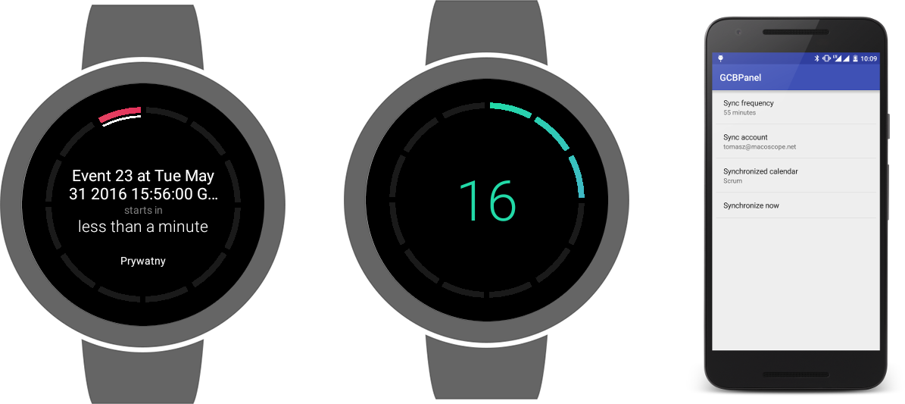
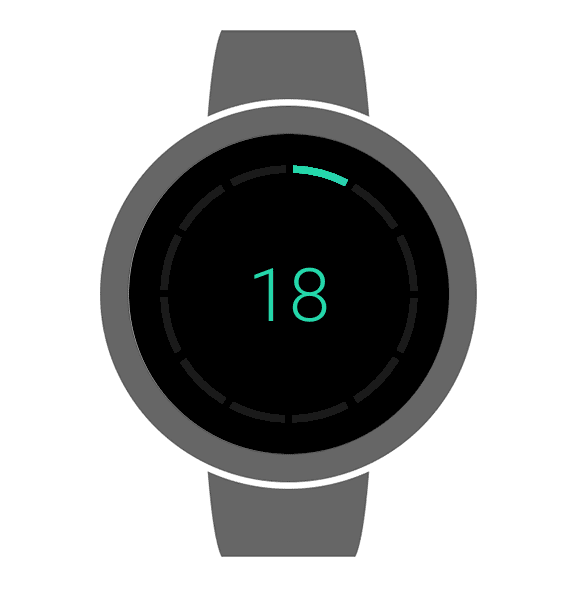
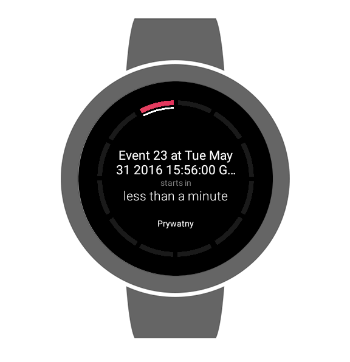

# GCBAndroidWearWatchFace

General purpose of GCB Android Wear Watch Face is displaying upcoming event directly on your wearable - from now on you never forgot about important meeting!  Of course GCB Watch Face have also time indication :) Project was described in two blog posts: [post part 1](http://macoscope.com/blog/) and [post part 2](http://macoscope.com/blog/)



Grand Central Board Watch Face is part of wider idea of interactive [Grand Central Board](https://github.com/macoscope/GrandCentralBoard) available for your company open spaces. 

## Watch Face

Watch Face works in two modes: time and event indication. User is able to switch between modes by tapping on watch display. Outer dashed oval presents elapsed time. Inner white indicator point in which time period next event will start. Each piece represents 5 minutes time interval. 

In time mode watch display in center current hour for hours with elapsed no more than 30 minutes, for hours with elapsed 30 minutes and more watch show upcoming hour. 



In event mode watch face display upcoming event with information such as event title, minutes to event start and calendar name from which event is taken.



Code of watch face is placed in [watchface](https://github.com/macoscope/GCBAndroidWearWatchFace/tree/master/watchface) module.

## Handheld App (Watch Face Settings)

Is responsible for querying events periodically from selected user’s calendar and sending them to wearable device. User can choose account, calendar for synchronization and time interval for periodic watch face updates. Codebase of handheld app can be found in [gcbpanel](https://github.com/macoscope/GCBAndroidWearWatchFace/tree/master/gcbpanel) module.

## Credits

- Reactive codebase thanks to [RxJava](https://github.com/ReactiveX/RxJava) by Netflix and [RxAndroid](https://github.com/ReactiveX/RxJava) by RxAndroid authors, which  are  licensed under the Apache License, Version 2.0.
- Using Optional in RxJava based on [RxJava-Optional](https://github.com/eccyan/RxJava-Optional)  by eccyan licensed under the Apache License, Version 2.0.
- Code responsible of data synchronization betweene handhelded app and android wear watch is based on [RxWear](https://github.com/patloew/RxWear) library by patloew, which is licensed under the Apache License, Version 2.0.
- Job scheduling logic and running update service in background are based on [Android-Job](https://github.com/evernote/android-job), which is licensed under the Apache License, Version 2.0. 

## Copyright

```
Copyright 2016  Macoscope Sp. z o.o.

Licensed under the Apache License, Version 2.0 (the "License");
you may not use this file except in compliance with the License.
You may obtain a copy of the License at

    http://www.apache.org/licenses/LICENSE-2.0

Unless required by applicable law or agreed to in writing, software
distributed under the License is distributed on an "AS IS" BASIS,
WITHOUT WARRANTIES OR CONDITIONS OF ANY KIND, either express or implied.
See the License for the specific language governing permissions and
limitations under the License.
```

